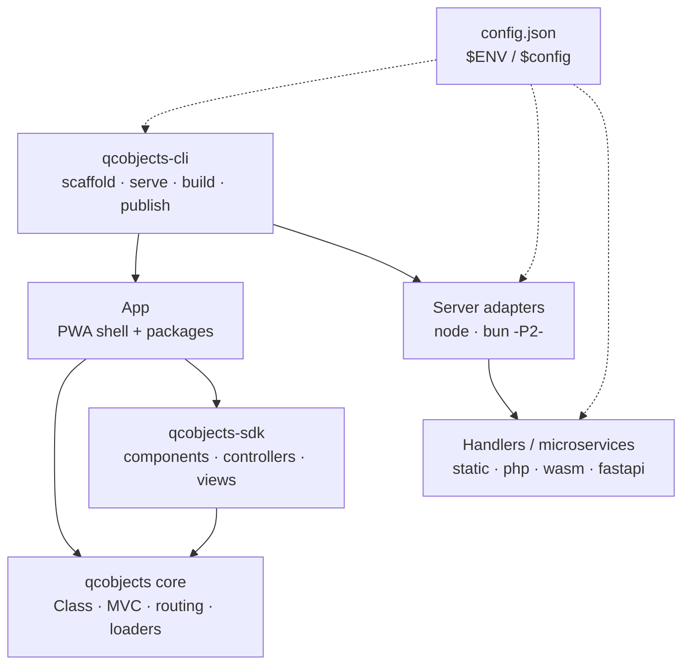
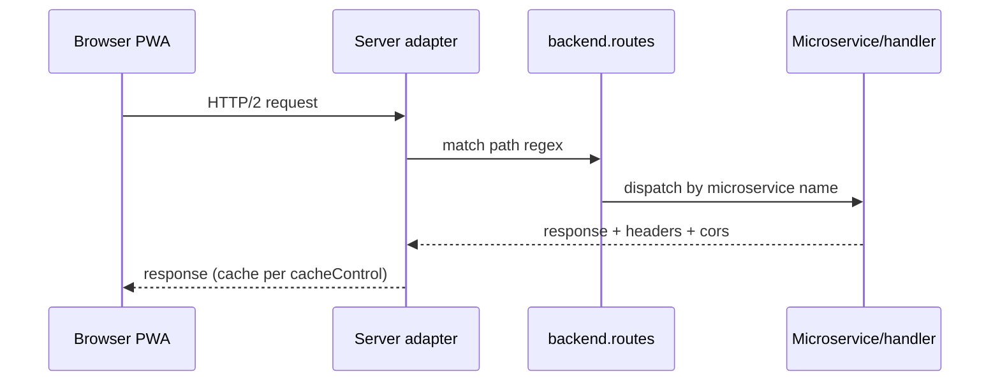
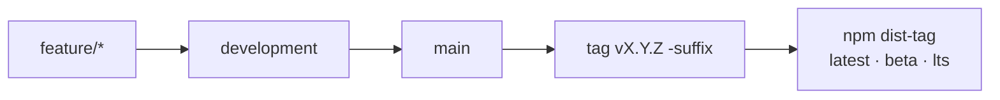

# 13 — Diagrams

## Purpose

Visual system maps. Sources live in `diagrams/*.mmd`; rendered views are the
Mermaid blocks below (GitHub renders them natively).

## Scope

Ecosystem map, request lifecycle, release flow, component tree, nested routing,
and component layout. Per-component internals
belong in code comments, not here.

## Ecosystem map



Source: [`diagrams/ecosystem.mmd`](https://github.com/QCObjects/product-specs/blob/development/diagrams/ecosystem.mmd)

## Request lifecycle



## Release flow



Source: [`diagrams/release-flow.mmd`](https://github.com/QCObjects/product-specs/blob/development/diagrams/release-flow.mmd)

## Component tree (Nested Components Stack)

```mermaid
flowchart TB
    G[global.componentsStack] --> C1[Component main<br/>cached · MainController]
    C1 --> T1[template main.tpl.html<br/>{{data}} bindings]
    C1 --> C2[Component grid<br/>GridController 2x2]
    C2 --> S1[subcomponent card xN<br/>DataGridController mapping]
    C1 --> C3[Component signup-form<br/>FormField · FormController]
    C3 --> SVC[SignupClientService<br/>JSONService POST]
    SVC --> MS[Microservice<br/>org.quickcorp.backend.signup]
```

Source: [`diagrams/component-tree.mmd`](https://github.com/QCObjects/product-specs/blob/development/diagrams/component-tree.mmd)

## Nested components routing

```mermaid
flowchart TB
    LOC[location<br/>hash / pathname / search] --> WAY{routingWay<br/>from CONFIG}
    WAY --> R1[Component main<br/>own routings table]
    R1 -->|match path regex<br/>{param} groups| SEL1[routingSelected<br/>read-only]
    SEL1 --> T1[template main.tpl.html<br/>render]
    SEL1 --> SUB[__buildSubComponents__<br/>nested scan]
    SUB --> R2[Subcomponent grid<br/>own routings table]
    R2 -->|match| SEL2[routingSelected]
    SEL2 --> T2[template grid.tpl.html<br/>render]
    SEL2 --> R3[Sub-subcomponent card<br/>own routings table]
    R3 -->|match| T3[template card.tpl.html<br/>render]
    R3 -->|no routing children| DFLT[default template<br/>unconditional]
```

Source: [`diagrams/nested-routing.mmd`](https://github.com/QCObjects/product-specs/blob/development/diagrams/nested-routing.mmd)

## Component layout (anatomy)

```mermaid
flowchart TB
    TAG["&lt;component&gt; tag / widget<br/>name · cached · data-* · *Class attrs"] --> INST[Component instance<br/>body · data · method]
    INST --> CLS[class hierarchy<br/>Component subclass]
    INST --> TPL[template<br/>inline / URI / none]
    INST --> HDL[templateHandler<br/>Default or custom]
    TPL --> HDL
    HDL --> BIND["{{data}} binding<br/>$…() processors"]
    BIND --> BODY[body DOM / shadowRoot]
    INST --> CTL[controller<br/>done() per load]
    INST --> VIEW[view]
    INST --> EFF[effectClass]
    INST --> SVC[services<br/>JSONService · serviceLoader]
    INST --> SUB[subcomponents<br/>nested stack]
    INST --> RTE[routings table<br/>path regex · {param}]
```

Source: [`diagrams/component-layout.mmd`](https://github.com/QCObjects/product-specs/blob/development/diagrams/component-layout.mmd)

## Normative

- Diagrams MUST match the specs: any layer/contract change MUST update the
  `.mmd` source and the block in this file in the same PR.
- New diagrams MUST be added as `.mmd` sources first, embedded second.

## Verification

- `npx --yes @mermaid-js/mermaid-cli -i diagrams/ecosystem.mmd` renders without errors.
- Same check MUST pass for every other `.mmd` in `diagrams/` when the set changes.
