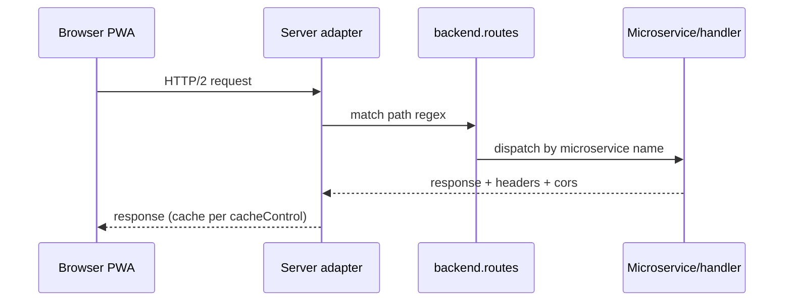
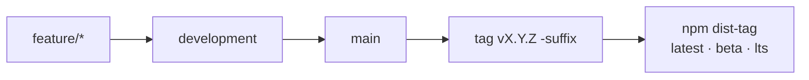

# 13 — Diagrams

## Purpose

Visual system maps. Sources live in `diagrams/*.mmd`; rendered views are the
Mermaid blocks below (GitHub renders them natively).

## Scope

Ecosystem map, request lifecycle, and release flow. Per-component internals
belong in code comments, not here.

## Ecosystem map

```mermaid
flowchart TB
    CLI[qcobjects-cli<br/>scaffold · serve · build · publish] --> APP[App<br/>PWA shell + packages]
    APP --> CORE[qcobjects core<br/>Class · MVC · routing · loaders]
    APP --> SDK[qcobjects-sdk<br/>components · controllers · views]
    SDK --> CORE
    CLI --> SRV[Server adapters<br/>node · bun -P2-]
    SRV --> H[Handlers / microservices<br/>static · php · wasm · fastapi]
    CFG(config.json<br/>$ENV / $config] -.-> CLI
    CFG -.-> SRV
    CFG -.-> H
```

Source: [`../diagrams/ecosystem.mmd`](../diagrams/ecosystem.mmd)

## Request lifecycle



## Release flow



## Normative

- Diagrams MUST match the specs: any layer/contract change MUST update the
  `.mmd` source and the block in this file in the same PR.
- New diagrams MUST be added as `.mmd` sources first, embedded second.

## Verification

- `npx --yes @mermaid-js/mermaid-cli -i diagrams/ecosystem.mmd` renders without errors.
